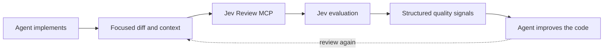

# Jev Review

> [!NOTE]
> This release sends reviews to the local 9Router gateway at `http://localhost:20128/v1/systemone`
> using model `openrouter/typesafe/jev-1.13`. Set `NINEROUTER_API_KEY` in the MCP
> process environment; OpenCode's saved login is not read by this server.

<div align="center">

**Continuous software-quality review for AI coding agents, powered by [Jev](https://typesafe.ai/).**

[](LICENSE)


[Quick start](#quick-start) · [Client setup](#client-setup) · [Quality dimensions](#quality-dimensions) · [Security](#security-and-privacy)

</div>

Jev Review runs as a local MCP server and gives Claude Code, Codex, Cursor, and OpenCode structured quality scores while they work. Your coding agent remains responsible for diagnosing weaknesses and changing the code; Jev supplies a fast scalar signal across correctness, complexity, changeability, modularity, tests, security, and other independent quality dimensions.

> [!IMPORTANT]
> **The MCP server sends requests only to the local 9Router gateway.** Jev Review has no hosted backend, database, telemetry service, or author-operated proxy. The gateway may forward review context and credentials to its configured provider; consult your gateway's policy before sending sensitive content.

## Demo

<p align="center">
  

https://github.com/user-attachments/assets/0ff9f873-0652-4826-af3d-6bb4f42c70b1


</p>

## At a glance

| | |
| --- | --- |
| **Purpose** | Continuous, structured software-quality evaluation |
| **Supported clients** | Claude Code, Codex, Cursor, OpenCode |
| **Distribution** | This GitHub repository—no npm publication |
| **Runtime** | Local Node.js process over MCP stdio |
| **Remote access** | Requests to the local 9Router gateway using its API key |
| **MCP tools** | One focused tool: `jev_review` |
| **Code changes** | Always performed by the primary coding agent |

## Quick start

Requirements:

- Node.js 20 or newer
- A running local 9Router gateway at `http://localhost:20128/v1/systemone` with model `openrouter/typesafe/jev-1.13` available
- `NINEROUTER_API_KEY` available to the MCP process
- Claude Code, Codex, Cursor, or OpenCode

Set your API key before starting the coding agent:

```bash
export NINEROUTER_API_KEY="your-gateway-key"
```

Install Jev Review directly from GitHub—no npm publication is required:

```bash
npx plugins add teerasakw/jev-review
```

Choose your coding client when prompted, restart it, and ask the agent to use `jev-review` while implementing a nontrivial change.

## How it works



Jev Review is intended for frequent, focused checkpoints: after a coherent implementation slice, after a score-driven improvement, and before final handoff. The first call establishes a baseline. The agent then inspects its own implementation, forms a hypothesis about weak dimensions, improves the code, validates it, and rescores.

Jev returns typed Score, Choice, and Noul decisions rather than a free-form review essay. It does not generate a prose explanation of why a score is low. Jev Review validates and converts those decisions into metric scores, confidence levels, coarse rubric hints, and comparisons with a previous evaluation. The coding agent—not Jev—must determine the actual cause and appropriate code change.

There is deliberately no synthetic “82/100” overall score. Dimension changes such as `Readability 6.3 → 8.1` and `Security 8.2 → 8.2` are more useful than a blended percentage.

## Client setup

| Client | Plugin installation | Manual MCP available |
| --- | --- | --- |
| Claude Code | `npx plugins add teerasakw/jev-review --target claude-code` | Yes |
| Codex | `npx plugins add teerasakw/jev-review --target codex` | Yes |
| Cursor | `npx plugins add teerasakw/jev-review --target cursor` | Yes |
| OpenCode | Manual configuration below | Yes |

Every client starts the same bundled `dist/server.js` process locally over stdio.

### Claude Code

```bash
npx plugins add teerasakw/jev-review --target claude-code
```

Restart Claude Code and run `/mcp` to confirm that `jev-review` is connected.

To load a local clone while developing:

```bash
claude --plugin-dir /absolute/path/to/jev-review
```

Manual MCP-only setup:

```bash
claude mcp add --scope user jev-review -- node /absolute/path/to/jev-review/dist/server.js
```

### Codex

```bash
npx plugins add teerasakw/jev-review --target codex
```

Restart Codex and run `/mcp` to verify the connection.

Manual setup in `~/.codex/config.toml`:

```toml
[mcp_servers.jev-review]
command = "node"
args = ["/absolute/path/to/jev-review/dist/server.js"]
env_vars = ["NINEROUTER_API_KEY"]
```

### Cursor

```bash
npx plugins add teerasakw/jev-review --target cursor
```

Restart Cursor and check **Settings → MCP**. The bundled skill is named `jev-review`; invoke it with `/jev-review` or leave it on **Agent Decides**.

Manual setup in `~/.cursor/mcp.json`:

```json
{
  "mcpServers": {
    "jev-review": {
      "type": "stdio",
      "command": "node",
      "args": ["/absolute/path/to/jev-review/dist/server.js"],
      "env": {
        "NINEROUTER_API_KEY": "${env:NINEROUTER_API_KEY}"
      }
    }
  }
}
```

If Cursor is launched from the macOS Dock, it may not inherit variables from your shell profile. Make the already-exported key available to GUI applications before starting Cursor:

```bash
launchctl setenv NINEROUTER_API_KEY "$NINEROUTER_API_KEY"
```

Verify without printing the key:

```bash
test -n "$(launchctl getenv NINEROUTER_API_KEY)" && echo "NINEROUTER_API_KEY is configured"
```

### OpenCode

OpenCode does not currently appear in the portable `plugins` installer targets. Point it at the same bundled server instead:

```bash
git clone https://github.com/teerasakw/jev-review.git
cd jev-review
opencode mcp add jev-review --global -- node "$PWD/dist/server.js"
```

For the full skill and MCP setup, add this to `~/.config/opencode/opencode.json`, replacing the absolute path:

```json
{
  "$schema": "https://opencode.ai/config.json",
  "skills": ["/absolute/path/to/jev-review/skills"],
  "mcp": {
    "servers": {
      "jev-review": {
        "type": "local",
        "command": ["node", "/absolute/path/to/jev-review/dist/server.js"],
        "environment": {
          "NINEROUTER_API_KEY": "{env:NINEROUTER_API_KEY}"
        }
      }
    }
  }
}
```

Run `opencode mcp list` to verify the connection. OpenCode may display the tool as `jev-review_jev_review`; the underlying MCP tool is still `jev_review`.

## MCP tool

Jev Review intentionally starts with one tool: `jev_review`.

```ts
{
  task?: string;
  diff?: string;
  files?: Array<{
    path: string;
    content: string;
  }>;
  repositoryContext?: string;
  previousEvaluation?: Evaluation;
}
```

At least one current-context field is required. Callers should normally send the task and focused diff, adding complete files only when the surrounding implementation is necessary to understand the change. Jev Review never reads the repository automatically.

Jev Review does not impose an additional character, token, or file-count limit. The configured gateway or provider may enforce its own token ceiling. When it returns `max_tokens_exceeded`, the server asks the agent to reduce unrelated context or split the change into coherent review slices.

The response contains:

- An independent 1–10 score and 0–1 confidence for each applicable metric
- `{ "applicable": false }` for dimensions unsupported by the supplied context
- Prioritized weak dimensions and coarse predefined rubric hints—not generated root-cause explanations
- Per-metric deltas, improvements, regressions, and unresolved weaknesses when `previousEvaluation` is supplied

## Quality dimensions

Always evaluated when the supplied context is sufficient:

- Correctness and requirement fit
- Cognitive complexity
- Readability and intent
- Modularity and cohesion
- Coupling and dependency quality
- Changeability and change amplification
- Abstraction and API design
- Project and file structure
- Duplication and reuse
- Maintainability
- Testability and test quality
- Reliability and error handling
- Security
- Consistency and conventions
- Documentation and explainability

Evaluated only when relevant evidence is present:

- Performance and resource efficiency
- Scalability and flexibility
- Compatibility and API stability
- Observability and operability

The evaluator judges consequences in context. It does not assume short functions, small files, zero duplication, more layers, more comments, or more tests are automatically better.

## Evaluation workflow

The included `jev-review` skill teaches agents to treat Jev as a repeated scalar feedback loop:

1. Understand the task and inspect the repository.
2. Implement a coherent change and run relevant checks.
3. Call `jev_review` with focused context to establish a baseline.
4. Inspect the code themselves and form a hypothesis for weak important scores.
5. Make the smallest justified improvement and validate it.
6. Rescore with `previousEvaluation`, then inspect improvements and regressions.
7. Repeat while another evidence-based improvement remains.
8. Stop when requirements and checks pass and further score-seeking would add little real value.

Correctness and the user's requirements always outrank score improvement. A higher score never justifies speculative architecture, unnecessary abstraction, scope expansion, breaking behavior, meaningless tests, or needless rewrites.

## Architecture

```text
jev-review/
├── plugin.json                  # Portable Agent Plugin manifest
├── mcp.json                     # Portable stdio MCP definition
├── .claude-plugin/
│   └── plugin.json              # Claude Code adapter
├── .codex-plugin/
│   └── plugin.json              # Codex metadata
├── skills/
│   └── jev-review/
│       └── SKILL.md             # Agent review workflow
├── src/
│   ├── config/                  # Environment handling
│   ├── evaluation/              # Metrics, scoring, and comparisons
│   ├── jev/                     # Direct Jev client and validation
│   └── mcp/                     # MCP tool boundary
├── dist/
│   └── server.js                # Committed standalone server bundle
├── public/
│   └── jev-review-demo.mp4      # Product demonstration
└── test/                        # Unit and MCP protocol tests
```

`plugin.json` and `mcp.json` are the portable [Agent Plugins 1.0](https://agent-plugins.org/specification) package. `.claude-plugin/plugin.json` and `.mcp.json` provide Claude Code compatibility, while `.codex-plugin/plugin.json` supplies Codex metadata. These are small packaging adapters around one MCP implementation.

## Development

```bash
git clone https://github.com/teerasakw/jev-review.git
cd jev-review
npm install
npm run validate
```

Useful commands:

```bash
npm run check
npm test
npm run build
npx plugins discover .
claude plugin validate . --strict
```

`npm run build` creates the committed `dist/server.js` bundle. Unit and MCP protocol tests use local fakes and do not consume Jev API quota; a live Jev call requires `NINEROUTER_API_KEY`.

## Security and privacy

The local MCP process reads `NINEROUTER_API_KEY` and sends it in an Authorization header to `http://localhost:20128/v1/systemone`. This loopback HTTP hop is not TLS; keep the gateway bound to a trusted local interface. Jev Review never stores or logs the key.

Only the `task`, `diff`, `files`, and `repositoryContext` explicitly supplied to `jev_review` are sent to the gateway. `previousEvaluation` is compared locally and is not included in the current code context. No repository files are discovered or uploaded automatically.

The gateway may forward review context to its configured provider. Do not supply secrets or unrelated proprietary content, and review the gateway and provider privacy policies before use. Jev Review complements rather than replaces dedicated security tooling.

## License

[MIT](LICENSE)
